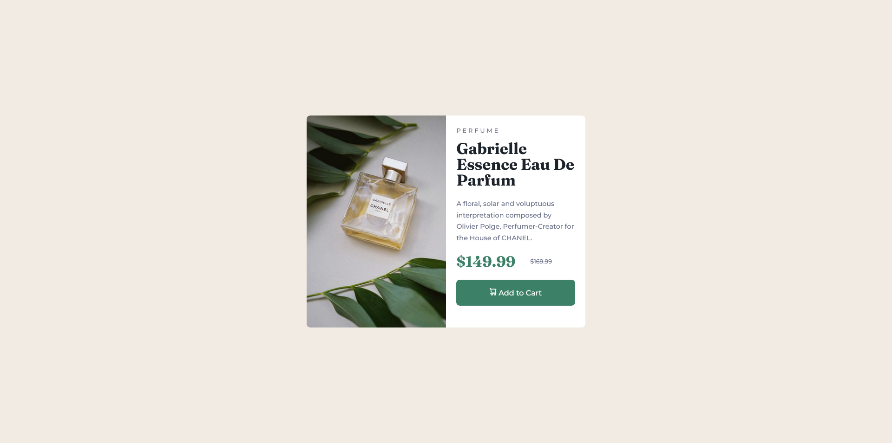
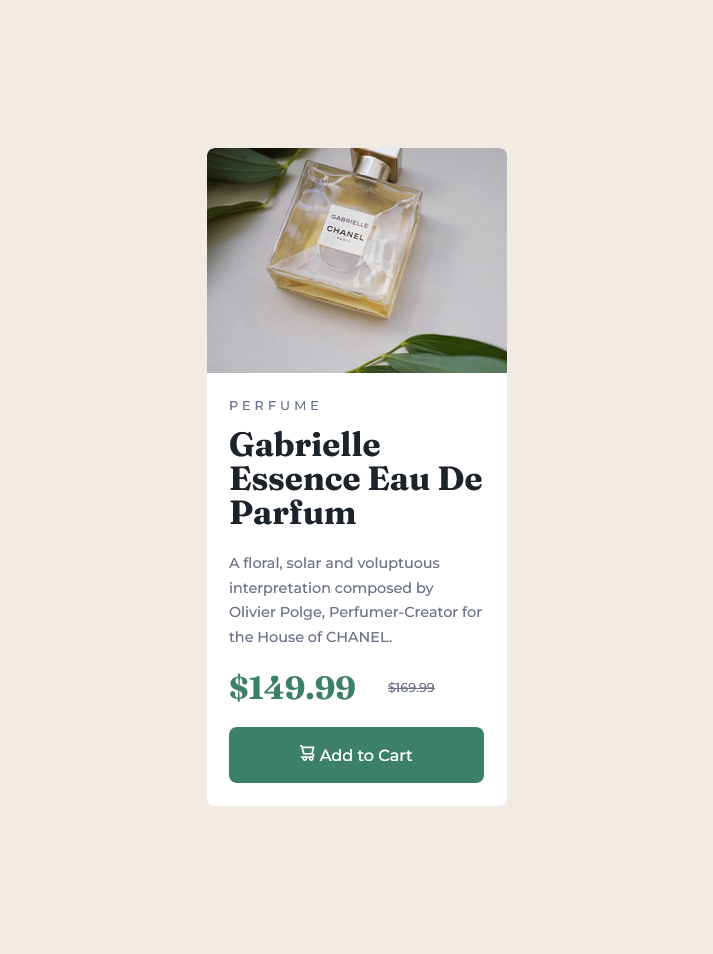

# Frontend Mentor - Product preview card component solution

This is a solution to the [Product preview card component challenge on Frontend Mentor](https://www.frontendmentor.io/challenges/product-preview-card-component-GO7UmttRfa). Frontend Mentor challenges help you improve your coding skills by building realistic projects.

## Table of contents

- [Overview](#overview)
  - [The challenge](#the-challenge)
  - [Screenshot](#screenshot)
  - [Links](#links)
- [My process](#my-process)
  - [Built with](#built-with)
  - [What I learned](#what-i-learned)
- [Author](#author)

## Overview

### The challenge

Users should be able to:

- View the optimal layout depending on their device's screen size
- See hover and focus states for interactive elements

### Screenshot




### Links

- Solution URL: [https://github.com/EidrianMax/product-preview-card-component-main](https://github.com/EidrianMax/product-preview-card-component-main)
- Live Site URL: [https://eidrianmax.github.io/product-preview-card-component-main/](https://eidrianmax.github.io/product-preview-card-component-main/)

## My process

### Built with

- Semantic HTML5 markup
- CSS custom properties
- Flexbox
- Mobile-first workflow
- BEM Methodologic

### What I learned

I learned how to use the property `aspect-ratio` and the `picture` element

To see how you can add code snippets, see below:

```html
<picture class="card__picture">
  <source
    media="(min-width: 768px)"
    srcset="./assets/images/image-product-desktop.jpg"
  />
  
</picture>
```

```css
.card__picture {
  aspect-ratio: 4 / 3;
  overflow: hidden;
}
```

## Author

- Frontend Mentor - [@EidrianMax](https://www.frontendmentor.io/profile/EidrianMax)
